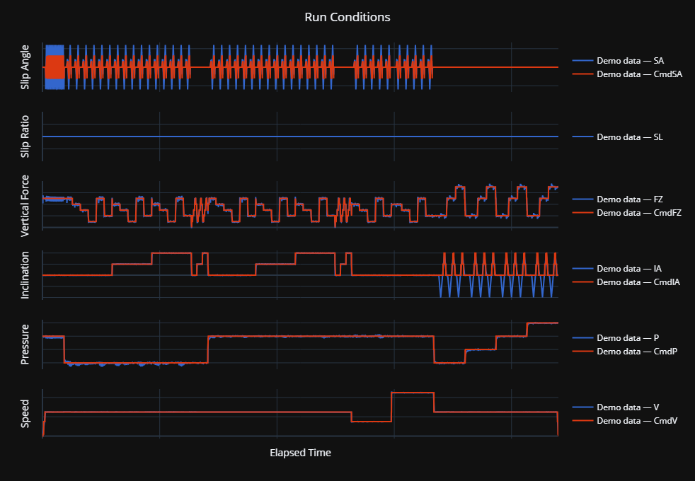

# GripLab User Guide - v2026.05.2

## Table of Contents
1. [Getting Started](#getting-started)
2. [Importing Data](#importing-data)
3. [Managing Datasets](#managing-datasets)
4. [Sessions](#sessions)
5. [Settings](#settings)
6. [Page Management](#page-management)
7. [Scatter Plots](#scatter-plots)
8. [Scatter Plot Settings](#scatter-plot-settings)
9. [Time Series Plots](#time-series-plots)
10. [Time Series Plot Settings](#time-series-plot-settings)
11. [Tips and Tricks](#tips-and-tricks)
12. [Troubleshooting](#troubleshooting)

---

## Getting Started

### Installation
GripLab is available as a standalone executable — no installation required.

1. Navigate to the [GitHub repository](https://github.com/GraysonBrowne/GripLab)
2. Click **Releases** and download the executable from the **Assets** section
3. Move the executable to a dedicated folder — GripLab generates a log file and config file alongside the executable over time, so keeping it organized in its own folder is recommended 
   * Example path:
    * ```
        Desktop/
            └── GripLab/
                └── GripLab.exe
        ```

### Launching the App
Double-click the executable to launch. A terminal window will open — this is the local server that hosts the app. GripLab will then open automatically in your web browser.

> **Important:** Keep the terminal window open for the duration of your session. It is the local server running the app — closing it will stop the app from responding.

The terminal also displays log output and is a useful reference if something goes wrong.

GripLab opens with a default **Time Series** page pre-configured with six subplots (SA/CmdSA, SL, FZ/CmdFZ, IA/CmdIA, P/CmdP, V/CmdV) and a **Scatter** page. Import data to populate the plots.


---

## Importing Data

Click **Import Data** in the sidebar or under the **File Menu** to open a file selection dialog. Multiple files can be selected and imported at once.

**Supported formats:**
- `.mat` — MATLAB data files
- `.dat` / `.txt` — ASCII data files

All standard TTC data formats are supported in both file types.

Once imported, each dataset appears in the data table with its filename as the default name and an auto-assigned node color. Only selected datasets are plotted.


### Channel Definitions
| Channel | Definition | Units (USCS / Metric) |
|---|---|---|
| ET | Elapsed Time | sec |
| V | Road Speed | mph / kph |
| N | Wheel Rotation Speed | rpm |
| SA | Slip Angle | deg |
| IA | Inclination Angle | deg |
| RL | Loaded Radius | in / cm |
| RE | Effective Rolling Radius | in / cm |
| P | Pressure | psi / kPa |
| FX | Longitudinal Force | lb / N |
| FY | Lateral Force | lb / N |
| FZ | Normal Force | lb / N |
| MX | Overturning Moment | ft-lb / N·m |
| MY | Rolling Resistance Moment | ft-lb / N·m |
| MZ | Aligning Moment | ft-lb / N·m |
| NFX | Normalized Longitudinal Force | — |
| NFY | Normalized Lateral Force | — |
| RST | Road Surface Temperature | deg F / deg C |
| TSTI | Tire Surface Temperature — Inside | deg F / deg C |
| TSTC | Tire Surface Temperature — Center | deg F / deg C |
| TSTO | Tire Surface Temperature — Outside | deg F / deg C |
| AMBTMP | Ambient Temperature | deg F / deg C |
| SR | Slip Ratio (Machine Control) | — |
| SL | Slip Ratio | — |
| CmdV | Commanded Road Speed | mph / kph |
| CmdP | Commanded Pressure | psi / kPa |
| CmdFZ | Commanded Normal Force | lb / N |
| CmdIA | Commanded Inclination Angle | deg |
| CmdSA | Commanded Slip Angle | deg |

### Command Channels
Command channels (`CmdSA`, `CmdFZ`, `CmdIA`, `CmdP`, `CmdV`) are automatically generated when data is imported.

Command channels are generated by rounding each data point to the nearest value from a predefined list of target conditions derived from the TTC summary tables. This works well for channels that are held constant momentarily, but breaks down for channels that are actively swept (SA and IA in some cases) — in those cases the command channel is not meaningful and should be ignored as a filter.

The FZ channel is low-pass filtered before command target assignment to reduce noise. This improves accuracy during steady-state segments but can introduce errors near load transitions, where the filtered signal may lag the actual step.

<!-- [IMAGE PLACEHOLDER: screenshot of cmd channels overlaid once time history plots are available] -->
---

## Managing Datasets

### Renaming a Dataset
Click directly on the dataset name in the table to edit it inline.

### Changing Node Color
Click the colored cell next to a dataset name. This opens the **Data Info** tab in the sidebar. Alternatively, navigate to the **Data Info** tab and select the dataset from the dropdown.


From the Data Info tab you can update:
- **Name** — display name for the dataset
- **Node Color** — color used for this dataset in all plots
- **Tire ID** — tire identifier
- **Rim Width** — rim width
- **Notes** — any additional notes

Click **Update** to save changes.

### Removing a Dataset
Click the trash icon next to a dataset in the table. A confirmation dialog will appear before removal.

---

## Sessions

A session captures all imported datasets and the current plot state — selected channels, 
filters, plot type, and plot settings. Sessions can be saved to a file and reloaded 
later, making it easy to pick up where you left off.

### Saving a Session
Click **File → Save Session** to save the current session to a `.grip` file. Choose a 
location and filename in the dialog that appears.

### Loading a Session
Click **File → Import Session** to load a previously saved `.grip` file. All datasets and pages from the file will be restored and all plots will be regenerated automatically. Any datasets and pages currently loaded will be replaced.

> **Note:** If a session file was created with a different version of GripLab, a warning 
> will appear. The session will still load, but some settings may not restore correctly.

### Automatic Session Recovery
GripLab automatically preserves your session in memory while the local server is running. If the browser tab is closed or the connection drops, reloading the page will restore your datasets and all pages without any action required. This only works while the terminal window stays open — if the app is restarted, the in-memory session is lost. Use **Save Session** to preserve work across restarts.

---

## Settings

Click the **Settings** button in the header to open the settings panel.


| Setting | Description |
|---|---|
| **Theme** | Light or dark. Takes effect on next launch. |
| **Color Sequence** | The order of auto-assigned node colors as datasets are imported. |
| **Demo Mode** | Obfuscates dataset names and hides axis values across all scatter and time series plots — useful for demonstrations where TTC data should not be displayed publicly. |
| **Unit System** | USCS or Metric (see below). |
| **Sign Convention** | SAE, Adapted SAE, ISO, or Adapted ISO. |
| **Data Directory** | Default directory for the file import dialog. |

### Unit Systems

| Channel Type | USCS | Metric |
|---|---|---|
| Force | lbf | N |
| Moment | in·lbf | N·m |
| Length | in | cm |
| Pressure | psi | kPa |
| Speed | mph | km/h |
| Temperature | °F | °C |

### Sign Conventions
For a full description of the available sign conventions and their definitions, see
[Sign Convention](https://github.com/GraysonBrowne/GripLab/blob/main/docs/Sign_Convention.pdf) located under the **Help** tab. Conventions are defined per Pacejka (2012):

> Pacejka, H. B. (2012). *Tyre and Vehicle Dynamics* (3rd ed.). Butterworth-Heinemann.

---

## Page Management

GripLab supports multiple plot pages open simultaneously as tabs. Each page is independent and can be a scatter plot or a time series plot.

### Adding a Page
Click **Insert** in the header and select a page type:
- **Scatter Plot** — adds a new blank scatter page
- **Time Series** — adds a new blank time series page

### Renaming a Page
Select the page tab, then edit the **Page Name** field at the top of the **Plot Data** sidebar and press **Enter** to apply. Page names must be unique.

### Closing a Page
Click the **×** on a page tab to close it. At least one page must remain open at all times.

---

## Scatter Plots

### Plot Types
GripLab supports four scatter plot types, selectable from the **Plot Data** tab:

| Type | Description |
|---|---|
| **2D** | Standard scatter plot (X vs Y) |
| **2D Color** | Scatter plot with a third channel mapped to marker color |
| **3D** | Three-axis scatter plot |
| **3D Color** | Three-axis scatter plot with a fourth channel mapped to marker color |


### Channel Selection
Use the axis dropdowns to select which channel to plot on each axis. Available channels are populated from all imported datasets.

### Downsample Factor
The downsample factor controls how many data points are rendered. A factor of `n` plots every nth node.

- **Higher factor** → fewer points → faster, more responsive app
- **Factor of 1** → all points plotted

Start with a high downsample factor when first exploring a dataset, then reduce it as you narrow in on the conditions of interest.

### Command Channel Parsing
Use the command channel selectors to filter the dataset to specific test conditions — for example, viewing only data at a specific pressure, load, or inclination angle. Multiple filters can be active simultaneously.


### Overlaying Datasets
Multiple datasets can be selected in the table and plotted simultaneously. Each dataset retains its assigned node color unless a color axis is active, in which case all datasets share the same color scale. Hover over any point to see which dataset it belongs to and its channel values.

### Plot Toolbar
The Plotly toolbar appears in the top-right corner of the plot area and provides the following tools:

| Tool | Description |
|---|---|
| **Zoom** | Click and drag to zoom into a region |
| **Pan** | Click and drag to pan the view |
| **Reset axes** | Return to the default view |
| **Download PNG** | Save the current plot as an image |

---

## Scatter Plot Settings

Click the **⚙** icon next to the Plot button to open plot settings.


| Setting | Description |
|---|---|
| **Title** | Custom plot title. Defaults to the tire ID if all selected datasets share one, or a channel description if they differ. |
| **Subtitle** | Descriptive subtitle, auto-populated with the active command channel filter conditions. |
| **X / Y / Z / Color Labels** | Custom axis labels. Defaults to the standard channel name and unit. |
| **Color Map** | Color scale for color plots — Jet, Inferno, or Viridis. |
| **Font Size** | Axis and label font size. |
| **Marker Size** | Size of scatter plot markers. |
| **Marker Opacity** | Opacity of marker fill. Reducing opacity helps reveal overlapping points. |

---

## Time Series Plots

Time series plots display one or more channels against elapsed time (ET) as stacked subplots. Each subplot can overlay up to four channels on a shared Y-axis, making them well suited for comparing measured values against commanded targets or examining multiple channels over the same run.



### Subplots
Each time series page is made up of one or more subplots stacked vertically and sharing a common X-axis. Use the subplot selector dropdown in the **Plot Data** sidebar to navigate between subplots.

#### Configuring a Subplot
Each subplot has four channel slots and a Y-axis label:

- **Channel 1–4** — select a channel for each slot. Empty slots are skipped. Each slot corresponds to a fixed color from the active color sequence — Channel 1 always uses the first color, Channel 2 the second, and so on, regardless of which slots are filled.
- **Y-Axis Label** — optional label for the subplot's Y-axis. If left blank, the selected channel names are used.

#### Adding and Removing Subplots
- Click **+ Add Subplot** to append a new subplot below the current ones.
- Click **Remove** to delete the currently selected subplot.

### Plotting
Click **Plot** to generate or refresh the time series. All selected datasets are plotted simultaneously. Each dataset is drawn with a different line style (solid, dashed, dotted, dash-dot) to distinguish runs when overlaying multiple datasets.

### Plot Toolbar
The same Plotly toolbar available on scatter plots applies to time series plots.

---

## Time Series Plot Settings

Click the **⚙** icon next to the Plot button on a time series page to open plot settings.

| Setting | Description |
|---|---|
| **Title** | Optional title displayed at the top of the plot. |
| **Font Size** | Font size for axis labels and legend text. |
| **Line Width** | Thickness of plotted lines. |

---

## Tips and Tricks

- **Start coarse, refine later.** Begin with a high downsample factor to get a quick overview of the data, then reduce it once you've identified the conditions of interest.

- **3D plots handle more points.** Due to how Plotly renders 3D vs 2D, you can use a lower downsample factor on 3D plots without significantly impacting responsiveness. That said, 3D plots are better suited for interactive exploration — they are difficult to interpret as static images in reports.

- **Color plots work best with a single dataset.** When overlaying multiple datasets on a color plot, the color axis spans all datasets combined, making it difficult to distinguish between them. For multi-dataset comparisons, use standard 2D plots.

- **Use time series plots to verify test conditions.** Overlaying a channel with its command channel (e.g. FZ and CmdFZ) in a single subplot is an effective way to confirm the machine was holding the intended condition throughout a run.

- **Use multiple pages to compare analyses.** Each page retains its own channel selections and settings independently, so you can set up a time series overview on one page and a focused scatter plot on another without losing either configuration.

- **Plot toolbar** — the Plotly toolbar in the top-right corner of every plot provides
  zoom, pan, reset axes, and PNG download. On time series plots, zoom and pan operate
  across all subplots simultaneously due to the shared X-axis.

- **Interactive legends** — click any legend entry to toggle that trace on or off.
  On time series plots each subplot has its own legend.

- **Hide the sidebar** using the collapse button (☰) to give the plot more screen space.

- **Use demo mode for presentations.** Demo mode obfuscates all dataset names and axis values so you can walk through data and workflow without displaying any proprietary TTC data.

---

## Troubleshooting

### The app doesn't open in the browser
The browser window should open automatically on launch. If it doesn't, check the terminal window for a URL (typically `http://localhost:XXXX`) and open it manually.

### The app stops responding
Check that the terminal window is still open. If it has been closed, restart the app by double-clicking the executable again.

### The page reloaded and my data is gone
If the terminal window is still open, the session should restore automatically on reload. If the app was fully restarted (terminal closed and reopened), the in-memory session is lost. Use **File → Save Session** regularly to save a `.grip` file that can be reloaded after a restart.